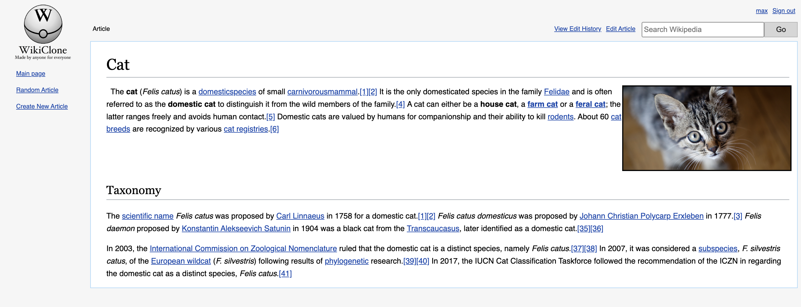
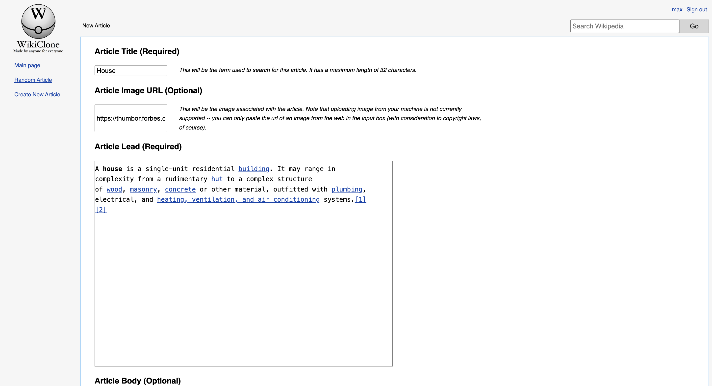
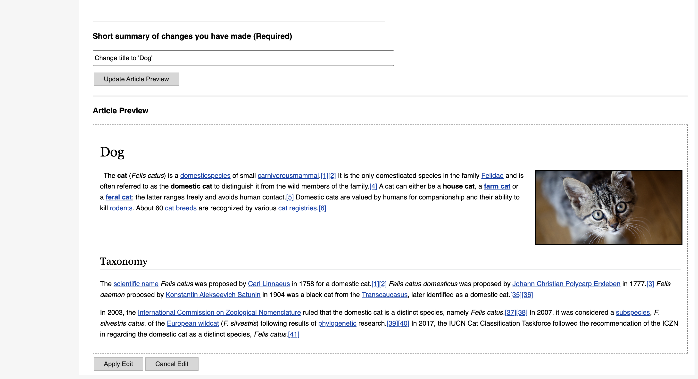
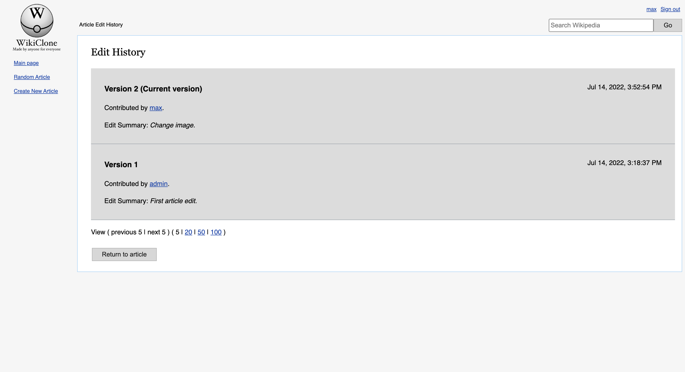
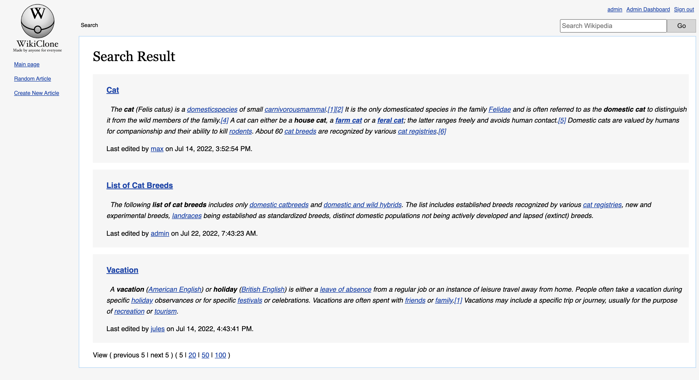
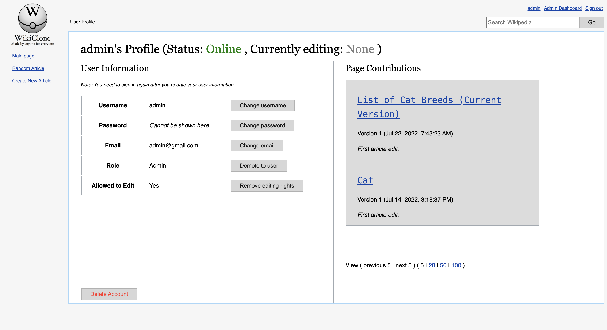
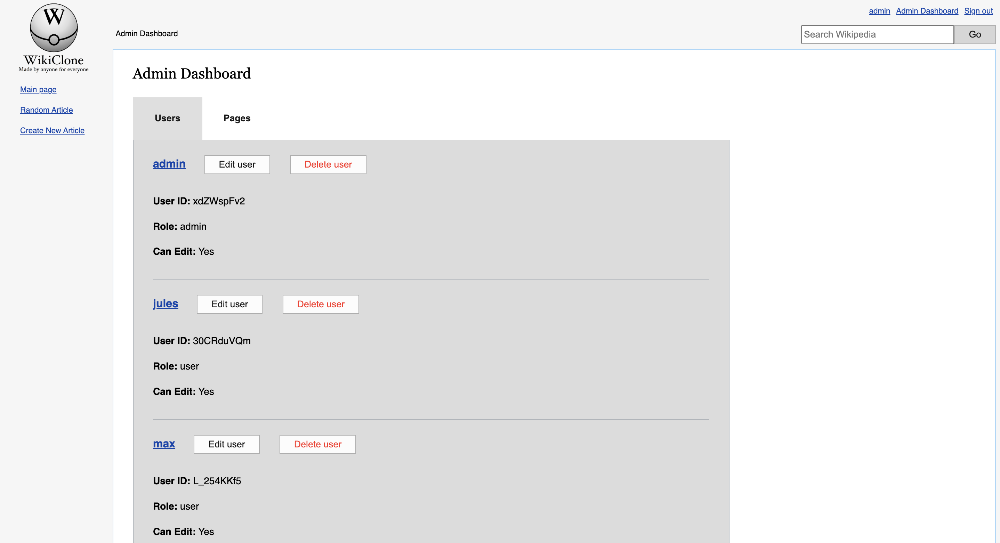

# Wikiclone

A Wikipedia clone.



## Features

### Create Article



### Edit Article



### View Article Edit History



### Search Article



### View User Profile and Page Contributions



### Admin Dashboard



## How to Build

This application requires Docker and Node.

```
> git clone https://github.com/marshblocker/wikiclone.git
> cd wikiclone/front-end
> npm install
> cd ../back-end npm install
> npm install
> cd ..
> docker-compose build --no-cache
> docker-compose up --build
```
